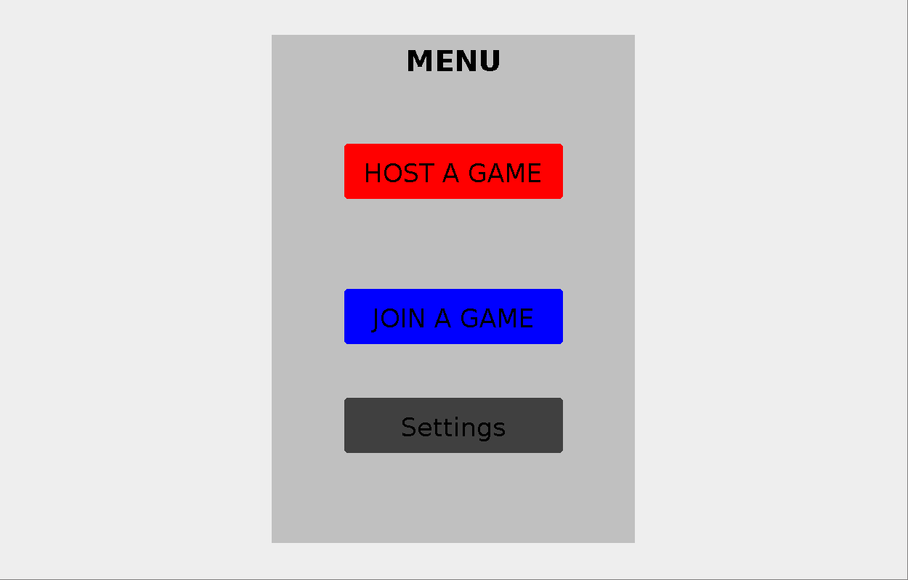
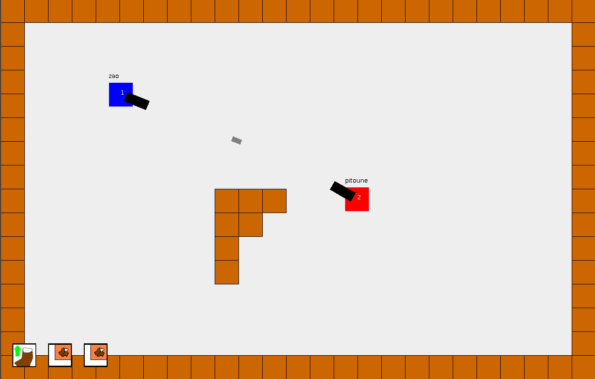
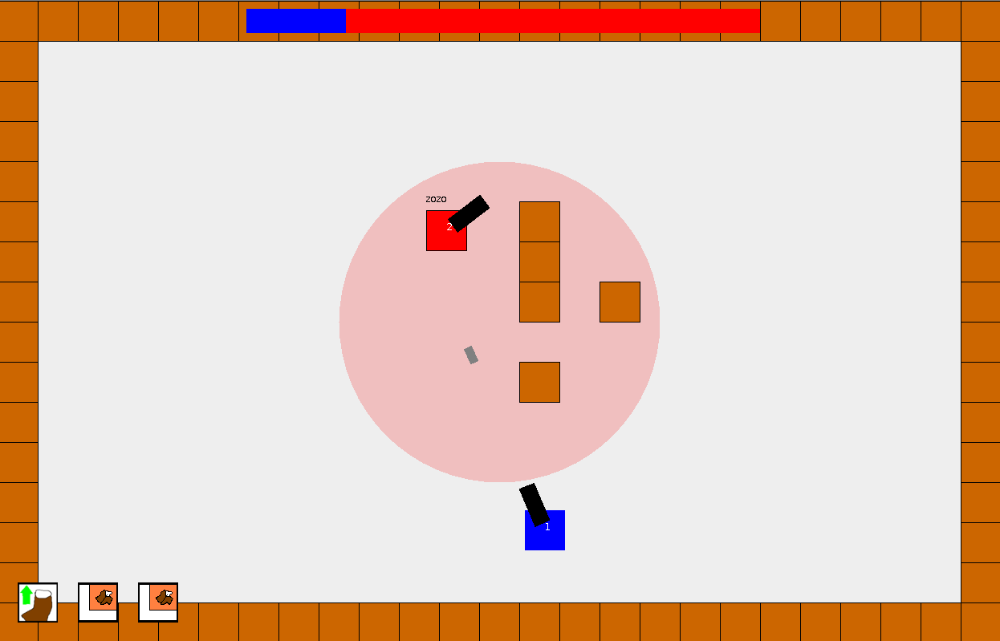

# FunOfTanks

_A **fun**, **mechanic** and **competitive** multiplayer game_

## Installation guide

### Clone the project
ssh   : `git clone git@github.com:zaofromage/FunOfTanks.git`

https : `git clone https://github.com/zaofromage/FunOfTanks.git`
### Compile and run
> Make sure you have java and java compiler
>> Test `java --version` and `javac --version`
>> 
>> If this fail :
>>> Linux : `sudo apt install default-jre default-jdk`
>>> 
>>> Windows : [Windows installation](https://www.oracle.com/java/technologies/downloads/#jdk23-windows)
>
> Once done :
>
> Linux : `./run.sh`
>
> Windows faut que je test j'ai pas d'ordi sous windows (dans le doute copie les commandes une par une qu'il y a dans run.sh)

## Game presentation

You can **host** or **join** a game with and play with people in the same network as yours

### Inputs
> You can change inputs in the **Settings** menu

| Action  | Input |
| ----- |:------------:|
| Move  | `Z Q S D`    |
| Dash  | `Space Bar`  |
| Shoot | `Left Click (hold)` |
| Build Mode | `Right Click (hold)` |
| Build (in build mode) | `Left CLick` |
| Skills | `E R A` |
| LeaderBoard | `tab` |

### Gameplay
You can play in multiplayer until 8 players in the same game 😲

You also have different **Game Modes**

* Domination 

